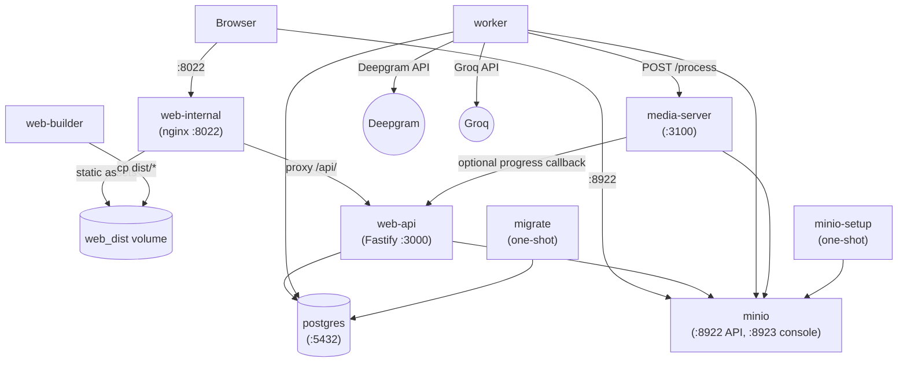
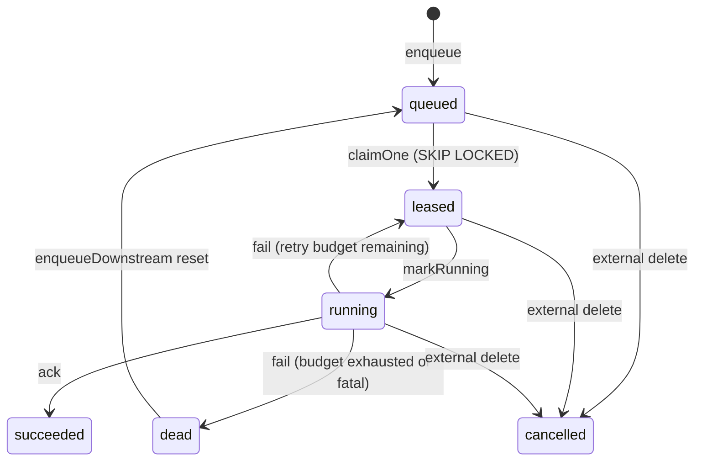
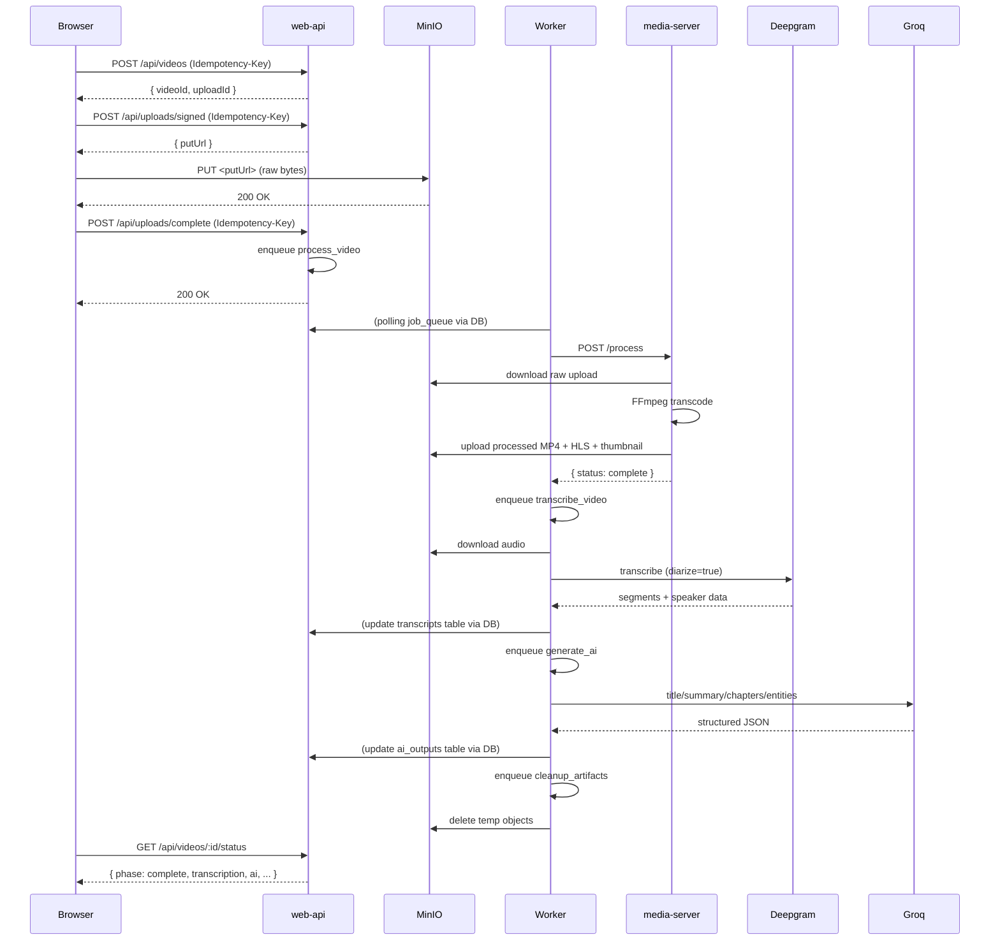

# cap4 Architecture

Current system architecture for the repo in this branch. This document follows the code, migrations, and `docker-compose.yml`.

## Runtime Topology

The default Docker stack defines nine services:

1. `postgres` — primary database
2. `migrate` — one-shot migration runner
3. `minio` — S3-compatible object storage
4. `minio-setup` — bucket/bootstrap helper
5. `web-api` — Fastify HTTP API on port `3000`
6. `worker` — background job runner
7. `media-server` — FFmpeg RPC service on port `3100`
8. `web-builder` — one-shot frontend build copier for the shared `web_dist` volume
9. `web-internal` — nginx serving the built frontend on port `8022`

## High-Level Flow

```text
Browser
  -> web-internal (nginx, :8022)
  -> web-api (:3000)
  -> postgres + minio

web-api
  -> creates videos/uploads rows
  -> enqueues process_video jobs
  -> serves status, retry, delete, upload endpoints
  -> exposes /health and /ready for liveness/readiness
  -> exposes POST /api/webhooks/media-server/progress for signed progress callbacks

worker
  -> claims jobs from job_queue with leasing
  -> runs process_video / transcribe_video / generate_ai / cleanup_artifacts / deliver_webhook
  -> calls media-server, Deepgram, and Groq
  -> updates database state and queues downstream jobs

media-server
  -> exposes /health and /process endpoints
  -> worker calls POST /process (synchronous RPC)
  -> processes video: downloads, runs ffmpeg, uploads outputs
  -> returns completion status to worker
```

## Source Of Truth

- Schema and enums: `db/migrations`
- Environment defaults: `packages/config/src/index.ts`
- API contracts: `apps/web-api/src/routes/*`
- Worker behavior: `apps/worker/src/index.ts`

When this document conflicts with code or migrations, code and migrations win.

## State Model

`videos` owns the primary processing state:

- `processing_phase`
- `processing_phase_rank`
- `processing_progress`
- `transcription_status`
- `ai_status`

`processing_phase` is monotonic through the webhook/API update guards. Transcription and AI are tracked separately once video processing completes.

Current processing phases:

- `not_required`
- `queued`
- `downloading`
- `probing`
- `processing`
- `uploading`
- `generating_thumbnail`
- `complete`
- `failed`
- `cancelled`

Current transcription statuses:

- `not_started`
- `queued`
- `processing`
- `complete`
- `no_audio`
- `failed`
- `skipped`

Current AI statuses:

- `not_started`
- `queued`
- `processing`
- `complete`
- `failed`
- `skipped`

## Job Queue

The worker operates on `job_queue`, not an external broker.

Job types currently used by the system:

- `process_video`
- `transcribe_video`
- `generate_ai`
- `cleanup_artifacts`
- `deliver_webhook`

Key properties:

- jobs are leased before execution
- heartbeats extend active leases
- expired leases can be reclaimed
- successful jobs are acknowledged in the queue
- terminal failures become `dead`

The queue also enforces one active job per `(video_id, job_type)` for active states, which is why enqueue paths must be conflict-aware.

## Upload Lifecycle

1. `POST /api/videos` creates a `videos` row and a pending `uploads` row.
2. The client requests signed upload URLs from `uploads` routes.
3. The client uploads bytes to MinIO.
4. The client marks the upload complete.
5. The API enqueues `process_video`.
6. Worker processing fans out into transcription and AI jobs as needed.

## Webhooks

There are two separate webhook concepts:

- Incoming: `POST /api/webhooks/media-server/progress`
  Route exists for signed progress updates and is covered by the API contract plus debug/test tooling.
- Outgoing: `deliver_webhook` jobs
  Sent to a user-provided `videos.webhook_url` after selected milestones.

Incoming webhook requests are HMAC-signed, timestamp-validated, deduplicated by delivery ID, and applied only if they pass monotonic state guards.

Current checked-in runtime note:

- The main worker path calls `POST /process` on `apps/media-server` and waits for a synchronous result.
- The checked-in `apps/media-server/src/index.ts` implementation shown in this repo does not itself emit signed progress callbacks during that mainline path.
- `deliver_webhook` is unrelated to the internal media progress route; it sends outbound user webhooks stored in `videos.webhook_url`.
- Debug-only routes such as `/debug/smoke` exist only in non-production builds and are not part of the production contract.

## Diagrams

### Service Topology



### Job State Machine



### Upload Sequence



## Frontend Serving

The production-style Compose flow does not run Vite as a long-lived container. Instead:

- `web-builder` copies the built frontend into the shared `web_dist` volume
- `web-internal` serves those static assets through nginx on port `8022`

For package-level frontend development, use the app-local tooling in `apps/web`.
