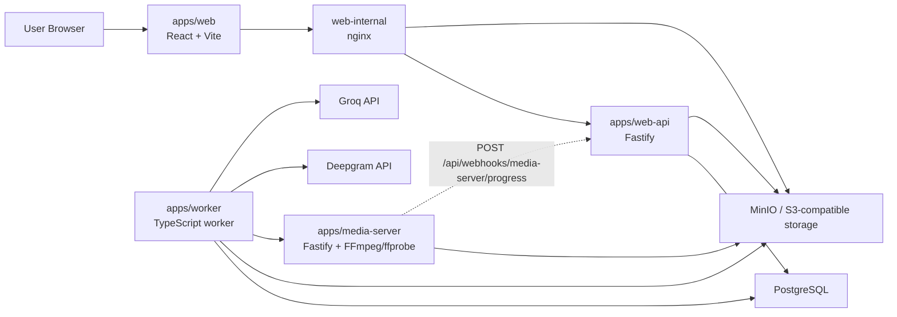

# System

This is the codebase-level guide to how cap5 works.

## Runtime topology

Main runtime services:

1. `apps/web` — React app
2. `apps/web-api` — Fastify API
3. `apps/worker` — background job runner using PostgreSQL as the queue
4. `apps/media-server` — FFmpeg/ffprobe wrapper

Shared infrastructure/services in the default stack:

- PostgreSQL — canonical metadata, queue state, transcripts, AI outputs, idempotency, webhook ledger
- MinIO / S3-compatible storage — raw uploads, processed MP4s, thumbnails, VTT
- nginx (`web-internal`) — serves the built frontend in Docker Compose

### Tech stack architecture



Truth anchors in code:

- schema: `db/migrations/`
- env contract: `packages/config/src/index.ts`
- API behavior: `apps/web-api/src/routes/`
- worker behavior: `apps/worker/src/handlers/`
- runtime topology: `docker-compose.yml`

## Architecture decisions

This repo keeps ADR-style records inline instead of maintaining a separate docs tree. Add a new entry here when a change alters a durable boundary, dependency, or operating model.

### ADR-001: PostgreSQL is the queue

- Status: accepted
- Why: the system is already PostgreSQL-backed, and `FOR UPDATE SKIP LOCKED` plus leases, heartbeats, reclaim, and terminal `dead` states cover the required job semantics without adding Redis or another broker.
- Consequences:
  - queue state is queryable in the same database as videos and transcripts
  - operational simplicity stays high
  - throughput is bounded by PostgreSQL capacity and current worker behavior

### ADR-002: Worker orchestration stays synchronous around media processing

- Status: accepted
- Why: `process_video` work is launched directly from the worker to media-server via `POST /process`, which keeps the pipeline easy to reason about and avoids another queue or callback hop for the mainline path.
- Consequences:
  - worker throughput is sensitive to long media-processing calls
  - media-server health directly affects `process_video` throughput
  - scaling media work means scaling worker and media-server deliberately, not just adding API instances

### ADR-003: Webhook signing uses the same HMAC shape inbound and outbound

- Status: accepted
- Why: inbound media-server callbacks mutate system state and outbound user webhooks cross a trust boundary, so both should carry timestamped HMAC headers with the same canonical format.
- Consequences:
  - inbound progress updates keep HMAC validation, timestamp skew enforcement, delivery dedupe, and monotonic progress guards
  - outbound webhook consumers can verify `x-cap-timestamp`, `x-cap-signature`, and `x-cap-delivery-id` against the raw body
  - operators may separate secrets by setting `OUTBOUND_WEBHOOK_SECRET`; otherwise outbound signing falls back to `MEDIA_SERVER_WEBHOOK_SECRET`

### ADR-004: Single-user auth with stateless JWT

- Status: accepted (supersedes previous "no auth" scope constraint)
- Why: adding a login gate to protect the platform while preserving single-tenant simplicity. Email/password with bcrypt, stateless JWT (HS256), httpOnly cookie transport.
- Consequences:
  - one user account, all videos belong to that account
  - no user_id on videos table (single-tenant, no ownership scoping needed)
  - JWT_SECRET required env var, 7-day token lifetime
  - auth plugin decorates requests; route-level guards enforce protection
  - webhooks and health endpoints remain unauthenticated (HMAC for inbound, open for health)
  - see `docs/auth-plan.md` for current auth status and constraints

### ADR-005: Runtime naming is canonically `cap5`

- Status: accepted
- Why: runtime defaults, object-path routing, and webhook media type now standardize on `cap5`.
- Consequences:
  - `S3_BUCKET` defaults to `cap5`
  - same-origin object routing uses `/cap5/...`
  - inbound webhook payloads should use `application/cap5-webhook+json`

## Frontend authentication flow

The frontend implements a straightforward single-user auth gate:

1. **AuthProvider initialization** — wraps the app at the root level
   - On mount, calls `GET /api/auth/me` to check if user is authenticated
   - If 200: user is authenticated, stores user info in context
   - If 401: user is not authenticated, directs to login/setup flow

2. **Initial setup** — first run when zero users exist
   - `GET /api/auth/status` returns `{ setupRequired: true }`
   - Frontend shows `SetupPage` with email + password form
   - `POST /api/auth/setup` creates the initial account
   - On success, redirects to home page

3. **Login** — when account exists but user is not authenticated
   - `LoginPage` shows email + password form
   - `POST /api/auth/login` authenticates
   - On success, receives httpOnly `cap5_token` cookie and redirects to home page
   - On failure (401), shows error message and stays on login page

4. **Authenticated routes** — all main pages require auth
   - `RequireAuth` wrapper in App.tsx checks AuthContext.authenticated
   - If false: redirects to `/login` or `/setup` as appropriate
   - If true: renders protected routes (home, record, video detail)

5. **Token storage** — httpOnly cookie only
   - `POST /api/auth/login` sets `cap5_token` cookie (Secure, SameSite=Strict)
   - Browser automatically sends cookie on all same-origin requests
   - Frontend never touches the token directly (no localStorage, no JS access)
   - Reduces XSS exposure of the credential

6. **User context** — available throughout the app
   - `AppShell` header displays user email and sign-out button
   - `AppShell` sign-out button calls `POST /api/auth/logout` and clears context
   - Other pages can check `AuthContext.authenticated` for conditional UI

This design keeps auth state in the browser session (cookie) while ensuring the frontend always validates the user on app load via `GET /api/auth/me`.

## End-to-end lifecycle

### Recording to transcript flow

```mermaid
flowchart TD
    A["User opens Record page"] --> B["Browser starts screen/mic capture"]
    B --> C["Recording in progress"]
    C --> D["User stops recording"]
    D --> E["Browser finalizes video blob/file"]
    E --> F["Frontend creates video via POST /api/videos"]
    F --> G["API creates videos + uploads rows in PostgreSQL"]
    G --> H["Frontend requests signed upload URL or multipart session"]
    H --> I["Browser uploads raw media to MinIO/S3"]
    I --> J["Frontend calls upload complete endpoint"]
    J --> K["API enqueues process_video job"]

    K --> L["Worker claims process_video"]
    L --> M["Worker calls media-server /process"]
    M --> N["Media-server downloads raw file from storage"]
    N --> O["FFmpeg normalizes to MP4 and generates thumbnail"]
    O --> P["ffprobe extracts duration and media metadata"]
    P --> Q["Media-server uploads result artifacts to storage"]
    Q --> R["Worker marks processing complete"]

    R --> S{"Has audio?"}
    S -- "No" --> T["Transcription marked no_audio / skipped"]
    S -- "Yes" --> U["Worker enqueues transcribe_video"]

    U --> V["Worker claims transcribe_video"]
    V --> W["Worker sends media to Deepgram"]
    W --> X["Worker stores transcript, labels, and VTT"]
    X --> Y["Worker enqueues generate_ai"]

    Y --> Z["Worker claims generate_ai"]
    Z --> AA["Worker sends transcript to Groq"]
    AA --> AB["Worker stores title, summary, chapters, entities, action items, quotes"]
    AB --> AC["Frontend polls GET /api/videos/:id/status"]
    AC --> AD["Watch page shows processed video, transcript, and AI enrichments"]
```



### 1. Create video

`POST /api/videos`

- inserts a `videos` row
- inserts a matching `uploads` row
- optionally stores `webhook_url`
- returns `videoId` and `rawKey`

### 2. Upload raw media

Supported paths:

- single-part:
  - `POST /api/uploads/signed`
  - browser uploads to signed PUT URL
  - `POST /api/uploads/complete`
- multipart (files > 100 MB):
  - `POST /api/uploads/multipart/initiate`
  - `POST /api/uploads/multipart/presign-part` (per part)
  - browser uploads each 10 MB chunk to signed URL
  - `POST /api/uploads/multipart/complete` with ETag array
  - optional `POST /api/uploads/multipart/abort`

Completing the upload queues `process_video`.

### 3. Process video

Worker job: `process_video`

- fetches the raw upload key from `uploads` table
- calls `POST /process` on media-server with `{ videoId, rawKey }`
- media-server downloads the source from S3 to `/tmp/cap5-media/<videoId>/`
- FFmpeg normalizes to MP4: `ffmpeg -y -i <input> -map 0:v:0 -map 0:a:0? -c:v libx264 -preset veryfast -pix_fmt yuv420p -movflags +faststart -c:a aac -b:a 128k <output>`
- FFmpeg generates thumbnail: `ffmpeg -y -i <result> -vf thumbnail -frames:v 1 <thumb.jpg>`
- ffprobe extracts metadata: `ffprobe -v error -print_format json -show_streams -show_format <file>`
- media-server uploads result MP4 and thumbnail to S3
- media-server cleans up temp directory
- worker writes result metadata to `videos` (result_key, thumbnail_key, duration, width, height, fps)
- if audio exists, queues `transcribe_video` (priority 95)
- otherwise marks transcription `no_audio` and AI `skipped`

S3 key patterns:

- result: `videos/<videoId>/result/result.mp4`
- thumbnail: `videos/<videoId>/thumb/screen-capture.jpg`

### 4. Transcribe

Worker job: `transcribe_video`

- downloads processed media from S3
- extracts audio via FFmpeg when possible (falls back to full video)
- sends media to Deepgram with parameters:
  - model: `DEEPGRAM_MODEL` (default `nova-2`)
  - `smart_format: true`, `punctuate: true`, `utterances: true`, `diarize: true`, `detect_language: true`
- parses utterances into segments with `{ startSeconds, endSeconds, text, confidence, speaker }`
- builds WebVTT file from segments
- uploads VTT to S3: `videos/<videoId>/transcript/transcript.vtt`
- stores transcript row with segments_json and detected language
- marks transcription complete
- queues `generate_ai` (priority 90) when eligible
- if webhook_url exists, queues `deliver_webhook` with event `video.transcription_complete`

### 5. Generate AI enrichments

Worker job: `generate_ai`

- flattens transcript text from stored segments
- if transcript > 24,000 chars, splits into chunks by paragraph boundaries
- calls Groq chat completion:
  - model: `GROQ_MODEL` (default `llama-3.3-70b-versatile`)
  - temperature: 0.3
  - response_format: `{ type: "json_object" }`
  - system prompt requests structured JSON with title, summary, key_points, chapters, entities, action_items, quotes
- for multi-chunk transcripts: processes each chunk individually, then synthesizes a final combined result via additional Groq call
  - deduplicates chapters within 30-second intervals (max 12)
  - merges entities via Set deduplication
  - limits quotes to 5
- stores title, summary, chapters, entities, action items, and quotes in `ai_outputs`
- marks AI complete
- if webhook_url exists, queues `deliver_webhook` with event `video.ai_complete`

### 6. Cleanup artifacts

Worker job: `cleanup_artifacts` (queued by soft delete, delayed 5 minutes)

- collects all S3 keys: thumbnail_key, result_key, raw_key, vtt_key
- batch-deletes from S3 via `DeleteObjectsCommand`

### 7. Deliver webhook

Worker job: `deliver_webhook` (max 5 attempts, hardcoded)

- POSTs JSON to `webhookUrl` with `{ event, videoId, phase?, progress?, timestamp }`
- includes `x-cap-timestamp`, `x-cap-signature`, and `x-cap-delivery-id` headers
- retries on non-2xx responses

### 8. Watch / review

The frontend polls `GET /api/videos/:id/status` and renders:

- processed MP4 playback
- thumbnail
- transcript and editable transcript text
- editable speaker labels
- summary, chapters, entities, action items, quotes
- retry and delete actions

## Worker internals

### Job claiming

The main loop continuously calls `claimOne()` which runs:

```sql
SELECT id FROM job_queue
WHERE status IN ('queued', 'leased')
  AND run_after <= now()
  AND attempts < max_attempts
ORDER BY priority DESC, id ASC
FOR UPDATE SKIP LOCKED
LIMIT 1
```

Updates the claimed job to `status = 'leased'`, sets `locked_by`, `locked_until`, generates a fresh `lease_token`, and increments `attempts`.

Before claiming, the worker checks media-server health via `GET /health` (2s timeout). If unhealthy, `process_video` is excluded from claiming and the worker logs `worker.health.degraded`.

### Heartbeat

While a job is running, a heartbeat loop extends `locked_until` every `WORKER_HEARTBEAT_MS` (default 15s). If the heartbeat returns 0 rows (lease stolen), it logs `job.heartbeat.lost`.

### Reclaim expired leases

A background timer runs every `WORKER_RECLAIM_MS` (default 10s) and finds jobs where:

```sql
status IN ('leased', 'running') AND locked_until < now()
```

For each expired lease:

- if `attempts >= max_attempts`: transitions to `dead` and calls `markTerminalFailure()`
- otherwise: transitions back to `queued` with exponential backoff: `LEAST(7200, 30 * 2^(attempts - 1))` seconds (30s → 60s → 120s → ... capping at 2 hours)

### Fatal errors and dead-lettering

Provider responses with HTTP 401 or 403 are marked `fatal: true` and skip straight to `dead` without retrying.

When a job reaches `dead`, `markTerminalFailure()` updates the video:

- `process_video` → `processing_phase = 'failed'`, `error_message` set
- `transcribe_video` → `transcription_status = 'failed'`, `ai_status = 'skipped'` if still pending
- `generate_ai` → `ai_status = 'failed'`

### Deleted video handling

Before each handler phase, `ensureVideoNotDeleted()` checks `deleted_at`. If the video was deleted mid-processing, the job is ACKed silently without error.

### Maintenance

A background timer runs hourly for database maintenance tasks (cleanup of expired data).

## Queue model

The system uses PostgreSQL-only queueing.

Key mechanics:

- `job_queue` stores jobs
- active uniqueness exists per `(video_id, job_type)` for `queued|leased|running`
- worker claims jobs through lease semantics
- heartbeat extends active leases
- expired leases are reclaimed
- retries are bounded by `WORKER_MAX_ATTEMPTS`
- exhausted jobs become `dead`
- exponential backoff between retries

Current job types:

- `process_video`
- `transcribe_video`
- `generate_ai`
- `cleanup_artifacts`
- `deliver_webhook`

Important implementation note:

- `WORKER_CLAIM_BATCH_SIZE` exists in env/config, but the current worker loop claims one job at a time

## Media-server internals

The media-server is a single-file Fastify service (`apps/media-server/src/index.ts`) that exposes:

- `GET /health` → `{ ok: true }`
- `POST /process` → accepts `{ videoId, rawKey }`, returns `{ resultKey, thumbnailKey, durationSeconds, width, height, fps, hasAudio }`

### Processing pipeline

1. Validates `videoId` as UUID format
2. Creates temp directory: `/tmp/cap5-media/<videoId>/`
3. Downloads raw upload from S3 (`GetObjectCommand` → stream to file)
4. Transcodes with FFmpeg (H.264/AAC, veryfast preset, yuv420p, faststart)
5. Generates thumbnail (single best frame via `thumbnail` filter)
6. Probes metadata with ffprobe (duration, dimensions, fps, audio presence)
7. Uploads result MP4 (`video/mp4`) and thumbnail (`image/jpeg`) to S3
8. Cleans up temp directory (also cleaned on error)

### FFmpeg commands

Normalization:

```bash
ffmpeg -y -i <input> \
  -map 0:v:0 -map 0:a:0? \
  -c:v libx264 -preset veryfast -pix_fmt yuv420p -movflags +faststart \
  -c:a aac -b:a 128k \
  <output.mp4>
```

Thumbnail:

```bash
ffmpeg -y -i <result.mp4> -vf thumbnail -frames:v 1 <thumb.jpg>
```

Probe:

```bash
ffprobe -v error -print_format json -show_streams -show_format <file>
```

## Frontend architecture

### Tech stack

- React 18, React Router 6, Zustand 5 (state), Vite 5 (build), Tailwind CSS 3
- No component library — custom UI components in `components/ui/`

### Pages

- `HomePage` — video library grid with sorting (date/name/duration), filtering (all/processing/complete/failed), cursor-based pagination (limit 20), delete confirmation, provider status panel
- `RecordPage` — 3-step recording wizard: setup (mic/camera selection) → preview → upload. Uses MediaRecorder API for screen/tab/window capture with microphone mixing. Supports file upload fallback. Auto-triggers upload for screen recordings.
- `VideoPage` — video player with multi-tab sidebar (transcript, summary, chapters, notes, action items). Inline title editing. Transcript text, speaker label, and server-backed operator note editing. Speaker filters now sync to playback so deselected speakers are hidden in the transcript and skipped in video playback. Polls status every 2s with exponential backoff (up to 15s). Stops polling at terminal states. Retry/delete with confirmation dialogs.

### Recording flow

1. `getDisplayMedia()` captures screen/tab/window
2. If mic enabled: `getUserMedia()` for audio, creates `AudioContext` to mix display + mic audio
3. `MediaRecorder` records to WebM (`video/webm;codecs=vp8,opus` preferred)
4. On stop: chunks assembled into Blob, preview URL created
5. Upload: `POST /api/videos` creates record, then single-part or multipart upload based on size

### Upload strategy

- Files ≤ 100 MB: single-part signed PUT upload
- Files > 100 MB: multipart with 10 MB chunks, sequential part upload, ETag tracking

### State management

- `useVideoStore` (Zustand) — video page state with localStorage persistence
- `useRecordingMachine` — state machine for recording flow (idle → recording → preview → uploading → processing → complete)
- `useEventBus` — typed pub/sub for cross-component events (delete, escape)

### Keyboard shortcuts

- `Cmd+K` — command palette (fuzzy search across library videos)
- `Cmd+?` — shortcuts overlay
- `Esc` — dismiss overlays
- `Space` — play/pause (video page)
- Arrow keys — seek (video page)

### Key components

- `AppShell` — header, sidebar, main content layout
- `PlayerCard` — video player wrapper with custom controls and speaker-aware playback skipping when transcript speaker filters are active
- `TranscriptCard` — editable transcript with timestamps and speaker labels
- `SummaryCardCompact` — expandable AI summary
- `ChapterList` — chapter timeline with click-to-seek
- `ActionItemsPanel` — tasks with assignees and deadlines
- `CommandPalette` — Cmd+K quick navigation
- `ProviderStatusPanel` — Deepgram/Groq health display
- `ConfirmationDialog` — destructive action confirmation

### Frontend API client

`apps/web/src/lib/api.ts` provides typed functions for every API endpoint:

- `createVideo(name?)` → `{ videoId, rawKey }`
- `requestSignedUpload(videoId, contentType)` → `{ putUrl, headers }`
- `uploadToSignedUrl(putUrl, blob, contentType, onProgress?)` — XHR-based with progress callback
- `completeUpload(videoId)` → `{ jobId }`
- `uploadMultipart(videoId, blob, contentType, onProgress?)` → `jobId` — handles initiate/presign/upload/complete loop
- `getVideoStatus(videoId)` → full status with transcript, AI output, URLs
- `saveWatchEdits(videoId, {title?, transcriptText?, speakerLabels?, notesText?})` — idempotent
- `deleteVideo(videoId)` → `{ deletedAt }`
- `retryVideo(videoId)` → `{ jobsReset[] }`
- `getLibraryVideos({cursor?, limit?, sort?})` → `{ items[], nextCursor }`
- `getSystemProviderStatus()` → provider health with last job info

All mutation functions generate and send an `Idempotency-Key` header via `crypto.randomUUID()`.

## Performance and capacity guide

There is no checked-in formal benchmark suite yet. Treat this section as the current planning baseline for where the system will tighten first and what to measure before scaling.

### Primary bottlenecks

- worker throughput is effectively single-job-per-process today
- media-server work is CPU-heavy and disk-heavy because it downloads, transcodes, probes, and re-uploads full files
- provider latency can dominate end-to-end time once media processing is done
- PostgreSQL carries both application state and queue state
- frontend watch pages poll instead of using push updates

### What is true in code today

- the worker sleeps for `WORKER_POLL_MS` between claim attempts
- `WORKER_CLAIM_BATCH_SIZE` exists, but the main loop still claims only one job
- lease handling is timer-based with a 60s default lease, 15s heartbeat, and 10s reclaim pass
- media-server writes intermediates under `/tmp/cap5-media/<videoId>`
- media-server reads result artifacts into memory before upload
- provider calls are bounded by `PROVIDER_TIMEOUT_MS`

### Capacity planning rules of thumb

- scale `web-api` horizontally only when request volume is the bottleneck; it is otherwise the easiest service to multiply
- scale `worker` instances when queue wait time becomes the user-visible bottleneck
- scale `media-server` based on CPU, `/tmp` disk, and concurrent transcode pressure
- treat PostgreSQL as the shared choke point for both queue health and application reads/writes
- treat MinIO/S3 throughput as a real dependency for large uploads and large normalized outputs

### What to watch first

- queue depth by `job_type`
- count of `dead` jobs and reclaim events
- worker logs for repeated `worker.health.degraded` or `db.waiting`
- media-server latency, `/tmp` disk pressure, and FFmpeg failures
- provider timeout/failure rate for Deepgram and Groq
- readiness latency and database pool exhaustion symptoms
- poll-driven load on `GET /api/videos/:id/status` and `GET /api/system/provider-status`

### When to act

- add worker replicas when queued jobs stay backlogged longer than the acceptable user wait time
- add media-server capacity when transcodes, thumbnails, or uploads contend on CPU or temporary disk
- cache or rate-limit provider status if it becomes a steady source of avoidable DB load
- reconsider the worker claim loop if batching or parallelism becomes more important than current simplicity
- plan a push-based status channel before watch-page polling becomes a noticeable load source

## Data model summary

### `videos`
Main per-video state:

- `processing_phase`, `processing_phase_rank`, `processing_progress`
- `transcription_status`
- `ai_status`
- `result_key`, `thumbnail_key`
- duration/size/fps metadata
- `webhook_url`
- `operator_notes`
- `deleted_at`

### `uploads`
Upload lifecycle per video:

- mode: `singlepart|multipart`
- phase
- raw object key
- multipart upload id / etag manifest

### `job_queue`
Async work queue:

- job type, status, priority
- payload
- attempts / max attempts
- lease ownership fields
- `last_error`

### `transcripts`
Stored transcription output:

- provider, language, VTT key
- `segments_json`
- `speaker_labels_json`

### `ai_outputs`
Stored AI enrichment output:

- provider, model
- title, summary
- `chapters_json`
- `entities_json`
- `action_items_json`
- `quotes_json`

### `webhook_events`
Inbound media-server webhook ledger:

- delivery id, job id, video id
- phase/progress
- payload/signature
- accepted/rejected bookkeeping

### `idempotency_keys`
Mutation response cache keyed by endpoint + idempotency key.

## State model

Processing phases on `videos`:

- `not_required` (rank 0)
- `queued` (rank 10)
- `downloading` (rank 20)
- `probing` (rank 30)
- `processing` (rank 40)
- `uploading` (rank 50)
- `generating_thumbnail` (rank 60)
- `complete` (rank 70)
- `failed` (rank 80)
- `cancelled` (rank 90)

Separate status fields:

- `transcription_status`: not_started, queued, processing, complete, no_audio, skipped, failed
- `ai_status`: not_started, queued, processing, complete, skipped, failed

That split matters: media processing can be complete while transcription or AI is still running.

## Webhooks

### Inbound

`POST /api/webhooks/media-server/progress`

- HMAC-verified with `MEDIA_SERVER_WEBHOOK_SECRET`
- enforces timestamp skew
- dedupes deliveries
- applies monotonic phase/progress updates only
- records events in `webhook_events`

### Outbound

If a video has `webhookUrl`, the system can send:

- `video.progress` — queued by the API webhook route after accepted inbound progress updates
- `video.transcription_complete` — queued by the worker
- `video.ai_complete` — queued by the worker

Outbound payloads are JSON POSTs with `x-cap-timestamp`, `x-cap-signature`, and `x-cap-delivery-id` headers.

## Shared packages

### `@cap/config` (`packages/config/src/index.ts`)

Zod-validated environment schema. Fails fast on startup with clear error messages distinguishing missing vs invalid values. All env vars and their defaults are defined here — this is the canonical env contract.

### `@cap/db` (`packages/db/src/index.ts`)

PostgreSQL connection pool (pg). Per-DATABASE_URL singleton caching. Pool config: max 20, idle timeout 30s, connection timeout 5s. Exports `query<T>()`, `withTransaction()`, `resetPool()`, `disconnectAll()`.

### `@cap/logger` (`packages/logger/src/index.ts`)

Pino-based structured JSON logging. Redacts: password, secret, token, apiKey, authorization, DATABASE_URL, API_KEYS. Supports context propagation (requestId, userId, videoId, jobId, workerId) via child loggers. Pretty-printing with `LOG_PRETTY=true`.

## Code map by responsibility

- API routes: `apps/web-api/src/routes/`
- API shared helpers: `apps/web-api/src/lib/`
- API plugins: `apps/web-api/src/plugins/` (logging, health, validation)
- API types/schemas: `apps/web-api/src/types/`
- worker loop: `apps/worker/src/index.ts`
- worker handlers: `apps/worker/src/handlers/`
- worker queue logic: `apps/worker/src/queue/` (claim, lease, maintenance, sql)
- worker providers: `apps/worker/src/providers/` (deepgram, groq)
- worker lib: `apps/worker/src/lib/` (s3, ffmpeg, transcript)
- media processing service: `apps/media-server/src/index.ts`
- frontend pages: `apps/web/src/pages/`
- frontend components: `apps/web/src/components/`
- frontend hooks: `apps/web/src/hooks/`
- frontend API client: `apps/web/src/lib/api.ts`
- frontend utilities: `apps/web/src/lib/` (format, sessions, eventBus)

## Intentionally missing or incomplete

- multi-tenant isolation
- signed outbound webhooks
- active HLS processing path
- polished production deployment story beyond Docker Compose
