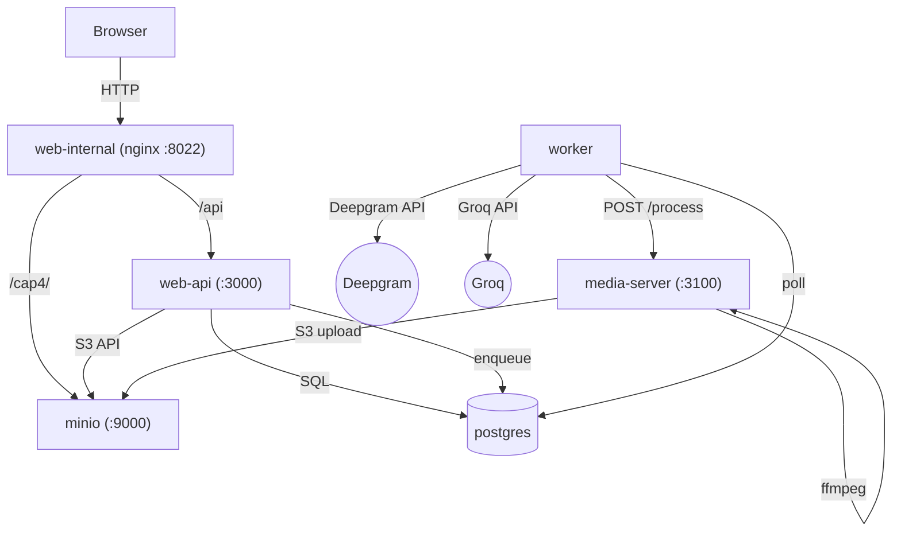
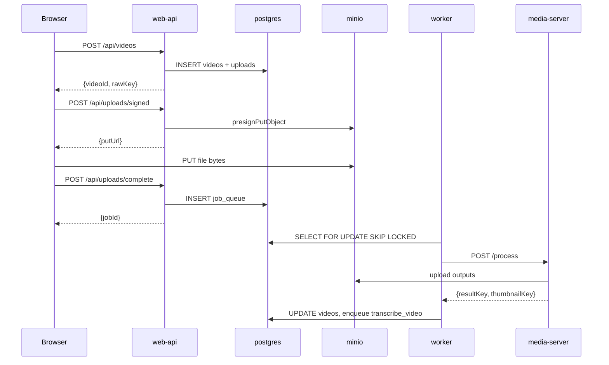

# cap4 — Documentation Refactor Plan

**Prepared by:** OpenClaw audit (senior technical writer perspective)  
**Audit date:** 2026-03-27  
**Project root:** `cap4 copy/`  
**Status:** Analysis only — no docs changed

---

## Table of Contents

1. [Executive Summary](#1-executive-summary)
2. [Docs Audit with Quality Scores](#2-docs-audit-with-quality-scores)
3. [Recommended Documentation Structure](#3-recommended-documentation-structure)
4. [README Rewrite Plan](#4-readme-rewrite-plan)
5. [Content Gaps](#5-content-gaps)
6. [Redundancy Elimination](#6-redundancy-elimination)
7. [AGENTS.md and CLAUDE.md Review](#7-agentsmd-and-claudemd-review)
8. [API Documentation Completeness](#8-api-documentation-completeness)
9. [Diagrams to Create](#9-diagrams-to-create)
10. [New Docs Needed](#10-new-docs-needed)
11. [Complexity Estimates](#11-complexity-estimates)
12. [Recommended Migration Path](#12-recommended-migration-path)

---

## 1. Executive Summary

cap4 has an **unusually well-maintained documentation suite** for a solo-developer project. Docs are regularly updated, aligned with code, and structured around concrete tasks. The primary weaknesses are:

1. **AGENTS.md and CLAUDE.md are identical** — the same 1,000+ line working memory file is duplicated verbatim across two filenames, creating maintainability debt.
2. **`docs/backend-cleanup-next-steps.md`** and **`docs/tasks.md`** carry operational/status content that belongs in GitHub Issues or a project board, not source-controlled docs.
3. **`docs/master-plan.md`** is under-utilized as a navigation hub — it still retains some milestone history that belongs in archive.
4. **No architecture diagrams** — the system has 9 Docker services, a state machine with 10 phases, a job queue, and 3 external API integrations. None of this has a visual representation.
5. **API documentation lacks request/response schemas** as formal types — curl examples are present but no TypeScript interface definitions or OpenAPI spec exists.

**Overall documentation score: 7.5/10** — well above average, with clear paths to 9/10.

---

## 2. Docs Audit with Quality Scores

Scoring dimensions: **Accuracy** (matches code), **Completeness** (covers the feature set), **Clarity** (readable, well-organized), **Maintenance** (stays current as code changes). Scale 1–5.

---

### `README.md`

| Dimension | Score | Notes |
|-----------|-------|-------|
| Accuracy | 5/5 | Matches current code and service topology precisely |
| Completeness | 4/5 | Missing: worker job types, AI pipeline overview, auth status nuance |
| Clarity | 4/5 | Upload flow curl examples are long — could be summarized |
| Maintenance | 5/5 | Updated alongside code; smoke target is correct |

**Overall: 4.5/5** — very good entry point. Minor improvements needed.

**Issues:**
- The upload flow bash example is 25+ lines and belongs in `docs/api.md`, not the README. README should show 3–4 lines and link to the full API reference.
- "Known Issues" section is thin: "No end-user auth" could link to `docs/master-plan.md` for context rather than being a bare bullet.
- No badge row (CI status, license, Node version). Even a simple CI badge adds at-a-glance health.

---

### `docs/api.md`

| Dimension | Score | Notes |
|-----------|-------|-------|
| Accuracy | 5/5 | Route shapes match code; enums correct; response shapes verified |
| Completeness | 4/5 | Missing: error catalog, rate-limit behavior details, pagination edge cases |
| Clarity | 4/5 | Long document — good, but navigation anchors are informal |
| Maintenance | 5/5 | Updated after Phase 4.7; reflects speaker labels and enrichment fields |

**Overall: 4.5/5**

**Issues:**
- No consolidated **error response catalog**. The doc mentions `{"ok": false, "error": "..."}` but doesn't enumerate known error codes/messages.
- No explicit documentation of the `Idempotency-Key` behavior: TTL, what constitutes a "replay" (same key + same body vs same key + different body), expiry cleanup.
- `GET /api/library/videos` cursor pagination behavior when `cursor` is omitted, stale, or invalid is undocumented.
- Webhook section note about "mainline worker path currently waits on synchronous POST /process" is accurate but creates confusion about when/if webhooks fire. This deserves a dedicated clarifying paragraph.

---

### `docs/architecture.md`

| Dimension | Score | Notes |
|-----------|-------|-------|
| Accuracy | 5/5 | Topology, state machine, and job types all match docker-compose and migrations |
| Completeness | 3/5 | No diagrams; webhook flow ambiguity not fully resolved; no FFmpeg pipeline detail |
| Clarity | 4/5 | Text flow diagram is readable; state model section is good |
| Maintenance | 4/5 | Updated 2026-03-23; reflects current service names |

**Overall: 4/5**

**Issues:**
- **No diagrams** — this is the document that most needs visual support. A service topology diagram and a state machine diagram would make this doc dramatically more useful.
- "Source Of Truth" section is valuable but buried. Should be more prominent.
- The webhook ambiguity note ("checked-in `apps/media-server` does not itself emit signed progress callbacks") is accurate but confusing. Readers don't understand when the webhook route is used in practice. Needs a clearer "When do webhooks fire?" section.

---

### `docs/database.md`

| Dimension | Score | Notes |
|-----------|-------|-------|
| Accuracy | 5/5 | Column lists, constraints, and migration history match SQL files exactly |
| Completeness | 4/5 | Missing: index rationale, JSONB field schemas, cascade delete behavior |
| Clarity | 4/5 | Well-structured; relationship section is helpful |
| Maintenance | 5/5 | Migration list complete through 0006 |

**Overall: 4.5/5**

**Issues:**
- The "Running Migrations" section at the bottom uses a bash `psql` loop — **this is the old manual approach** that predates the Node migration runner. The doc says to use `docker compose exec` psql loops, but the actual supported path is `pnpm db:migrate` (Node runner) or the automatic `migrate` service. This section is **misleading and should be removed or corrected**.
- JSONB field schemas (e.g., `segments_json`, `chapters_json`, `entities_json`) are documented by column name but not by schema shape. A TypeScript interface or JSON example would help frontend/backend contract alignment.
- No documentation of the `idempotency_keys` TTL or cleanup strategy.

---

### `docs/environment.md`

| Dimension | Score | Notes |
|-----------|-------|-------|
| Accuracy | 5/5 | All variables documented and match `.env.example` |
| Completeness | 4/5 | Missing `LOG_PRETTY`, `VITE_S3_BUCKET` details |
| Clarity | 5/5 | Excellent — table format, examples for each deployment mode, "Why two endpoints?" explanation |
| Maintenance | 5/5 | Current |

**Overall: 4.75/5** — one of the best docs in the suite.

**Issues:**
- `LOG_PRETTY` env var is used by `@cap/logger` but absent from this reference.
- Minor: `VITE_S3_BUCKET` is documented as "Leave unset unless you've changed `S3_BUCKET`" — could note the default value explicitly.

---

### `docs/local-dev.md`

| Dimension | Score | Notes |
|-----------|-------|-------|
| Accuracy | 5/5 | Docker Quick Start, port table, dev mode instructions all correct |
| Completeness | 4/5 | Missing: troubleshooting hot reload issues, pgAdmin setup, VS Code tips |
| Clarity | 5/5 | Best structured doc in the suite; dual-path (Docker / no-Docker) is clearly delineated |
| Maintenance | 5/5 | Rewritten in Phase 4.5; URL routing table is accurate |

**Overall: 4.75/5** — excellent.

**Issues:**
- "Running Tests" section references `pnpm --filter @cap/web-api exec node ./scripts/prepare-minio.mjs` but this script is in the app, not documented elsewhere. A short note on what it does would help.
- The manual API E2E setup block is long. Could be abbreviated with a reference to CI workflow for the canonical setup.

---

### `docs/deployment.md`

| Dimension | Score | Notes |
|-----------|-------|-------|
| Accuracy | 5/5 | Matches Compose stack and env var contracts |
| Completeness | 3/5 | No reverse proxy guidance, no TLS/HTTPS, no firewall notes, no monitoring |
| Clarity | 4/5 | Well organized; "What Gets Deployed" section is useful |
| Maintenance | 4/5 | Updated recently; deferred sections are clearly marked |

**Overall: 4/5**

**Issues:**
- **Zero guidance on HTTPS/TLS**. The platform handles media uploads and API keys. Production deployments without HTTPS are a security gap, and the docs don't even mention it.
- No guidance on firewall/security group rules for production (which ports to expose publicly vs. keep internal).
- No container registry or image tagging strategy documented.
- The "Backups and Recovery" section correctly disclaims automation but offers no concrete example commands for PostgreSQL backup (`pg_dump`) or MinIO backup.

---

### `docs/troubleshooting.md`

| Dimension | Score | Notes |
|-----------|-------|-------|
| Accuracy | 5/5 | Issue descriptions match actual failure modes |
| Completeness | 4/5 | Good coverage of common issues; missing: browser-side errors |
| Clarity | 5/5 | Concise; bash commands are copy-pasteable |
| Maintenance | 4/5 | Current; some sections may need updating after future changes |

**Overall: 4.5/5**

**Issues:**
- No section on **browser console errors** or network tab debugging. Upload failures often manifest in the browser first.
- No section on **worker memory/resource issues** (e.g., OOM kills during FFmpeg processing on low-RAM hosts).
- The "Full Reset" section uses `docker system prune -a` which is very destructive and affects other Docker projects. Should be scoped to project: `docker compose down -v --remove-orphans` + specific volume names.

---

### `docs/design-system.md`

| Dimension | Score | Notes |
|-----------|-------|-------|
| Accuracy | 4/5 | Token values appear current; component inventory updated through BJK-18 |
| Completeness | 3/5 | Missing: animation tokens, responsive breakpoints detail, form component patterns |
| Clarity | 4/5 | Well formatted; table-heavy sections are easy to scan |
| Maintenance | 3/5 | Updated 2026-03-24 but no process to keep CSS vars in sync |

**Overall: 3.5/5**

**Issues:**
- This doc lives in `docs/` but is primarily useful for frontend contributors. Could move to `apps/web/docs/design-system.md` to co-locate with the code it describes.
- No **animation/transition** token documentation despite BJK-9 (micro-interaction animations) having shipped.
- **No visual component gallery** — even screenshots or coded examples of the button, card, and input variants would be valuable.
- The "Design Maintenance Rules" section is good but needs enforcement (lint rules, component naming conventions).

---

### `docs/tech-stack.md`

| Dimension | Score | Notes |
|-----------|-------|-------|
| Accuracy | 4/5 | Framework versions appear current |
| Completeness | 3/5 | Missing: version pinning rationale, upgrade path, deprecation notes |
| Clarity | 5/5 | Table format is excellent |
| Maintenance | 3/5 | Version numbers will drift; no automated check |

**Overall: 3.75/5**

**Issues:**
- Vitest listed as `^4.0.18` but should verify this is the latest used. Major version bumps (Vitest 4) are significant.
- MinIO listed as "Latest" — should pin to the image tag used in `docker-compose.yml` (`RELEASE.2025-01-20T14-49-07Z`).
- No mention of `concurrently`, `dotenv-cli`, or other DX tools.
- Versions will drift from code — this doc benefits from automation (e.g., a script that reads `package.json` and generates the table).

---

### `docs/master-plan.md`

| Dimension | Score | Notes |
|-----------|-------|-------|
| Accuracy | 5/5 | Current state section is accurate |
| Completeness | 3/5 | Intentionally minimal; historical lineage is thin |
| Clarity | 4/5 | Good structure; "What This File Should Not Do" is a useful meta-constraint |
| Maintenance | 4/5 | Updated 2026-03-24 |

**Overall: 4/5**

**Issues:**
- "Delivered Milestones" section duplicates content already in `docs/tasks.md` and `AGENTS.md`/`CLAUDE.md`. With three places tracking the same phase history, future maintainers will face drift.
- The document's stated purpose ("high-level synthesis") is correct, but it needs clearer navigation links to help new contributors find the right starting point for different task types (debugging → troubleshooting.md, contributing → CONTRIBUTING.md, etc.).

---

### `docs/tasks.md`

| Dimension | Score | Notes |
|-----------|-------|-------|
| Accuracy | 4/5 | Status snapshot appears current |
| Completeness | 2/5 | Lists milestones but not concrete next actions |
| Clarity | 3/5 | Overlap with master-plan.md and backend-cleanup-next-steps.md |
| Maintenance | 3/5 | Will drift from reality quickly |

**Overall: 3/5**

**Issues:**
- This file is a **project-management artifact**, not a documentation resource. It should live in GitHub Issues/Milestones, not in `docs/`.
- Completely overlaps with `master-plan.md` for historical milestones.
- "Current Status" is a snapshot that will be stale within weeks.

---

### `docs/backend-cleanup-next-steps.md`

| Dimension | Score | Notes |
|-----------|-------|-------|
| Accuracy | 4/5 | References specific files with accurate descriptions |
| Completeness | 3/5 | Well-detailed for cleanup work; not a product doc |
| Clarity | 4/5 | Excellent internal structure with guardrails and resume checklist |
| Maintenance | 2/5 | Extremely time-sensitive; will be stale within one sprint |

**Overall: 3.25/5**

**Issues:**
- This is a **session handoff document** for an AI coding agent, not a product documentation resource. It should be in a `WORKLOG.md` at repo root or in `docs/archive/` once the work is complete.
- The "Resume Checklist" is operationally useful but belongs in `CONTRIBUTING.md` under a "Starting a new backend session" heading.
- Guardrails section is excellent — should be extracted into `CONTRIBUTING.md` as a "Refactor guidelines" section.

---

### `docs/qa.md`

| Dimension | Score | Notes |
|-----------|-------|-------|
| Accuracy | 5/5 | Test checklist matches current component surface |
| Completeness | 4/5 | Good regression surface; missing: upload flow regression, dark mode specific checks |
| Clarity | 4/5 | Well structured; component-to-file mapping is useful |
| Maintenance | 4/5 | Updated for Phase 4.7 features |

**Overall: 4.25/5** — solid QA documentation.

**Issues:**
- No regression checklist for the **upload flow** (singlepart and multipart). The transcript/AI side is well covered but the upload initiation and completion steps are absent.
- Dark mode visual regression is not mentioned.
- "Manual Spot Checks Worth Keeping" is too thin — should specify what to look for, not just what viewport to use.

---

### `docs/agents.md`

| Dimension | Score | Notes |
|-----------|-------|-------|
| Accuracy | 4/5 | Agent roles accurately described |
| Completeness | 3/5 | Describes Claude + Codex workflow; misses OpenClaw, Gemini |
| Clarity | 4/5 | Clean format |
| Maintenance | 3/5 | Will drift as AI tooling evolves |

**Overall: 3.5/5**

**Issues:**
- Codex as described is the legacy OpenAI Codex model, not the current Codex agent. This is already outdated.
- `CLAUDE.md`/`AGENTS.md` (root) mention Gemini being used for cross-validation but `docs/agents.md` doesn't.
- No guidance on **what agents should NOT do** (i.e., guardrails for AI-generated changes).
- Should include a section on verifying AI-generated changes before committing.

---

### `CONTRIBUTING.md`

| Dimension | Score | Notes |
|-----------|-------|-------|
| Accuracy | 5/5 | Commands and repo layout are correct |
| Completeness | 3/5 | Missing: PR template guidance, branch naming, versioning |
| Clarity | 4/5 | Concise and well-formatted |
| Maintenance | 4/5 | Appears current |

**Overall: 4/5**

**Issues:**
- No **PR description template** guidance or link to GitHub issue templates.
- No **branch naming convention** (feature/, fix/, chore/ etc.).
- The "Contribution Rules" list is good but vague on specifics — "add or update tests when behavior changes" doesn't say which test level or framework.
- Should mention `lint-staged` / pre-commit hooks once those are added.

---

## 3. Recommended Documentation Structure

### Current Structure

```
README.md
CONTRIBUTING.md
AGENTS.md              ← 1,000+ line working memory (AI context file)
CLAUDE.md              ← IDENTICAL to AGENTS.md (duplication)
docs/
  agents.md
  api.md
  architecture.md
  backend-cleanup-next-steps.md  ← session handoff, not product doc
  database.md
  deployment.md
  design-system.md
  environment.md
  local-dev.md
  master-plan.md
  qa.md
  tasks.md             ← project management artifact, not product doc
  tech-stack.md
  troubleshooting.md
  archive/
    audit-plan.md
    roadmap.md
```

### Recommended Structure

```
README.md              ← concise, links out; no 25-line curl blocks
CONTRIBUTING.md        ← expanded with PR workflow, branch naming, agent guardrails
CLAUDE.md              ← AI working memory (keep; source of truth)
AGENTS.md              ← thin wrapper: "See CLAUDE.md for working memory; see docs/agents.md for agent conventions"

docs/
  # === Navigation Hub ===
  index.md             ← NEW: docs landing page / reading order

  # === Core References ===
  architecture.md      ← add diagrams; clarify webhook dual-mode
  api.md               ← add error catalog, idempotency TTL, OpenAPI link
  database.md          ← fix migration section; add JSONB schemas
  environment.md       ← add LOG_PRETTY
  tech-stack.md        ← pin MinIO version; add DX tools

  # === Developer Guides ===
  local-dev.md         ← minor additions
  deployment.md        ← add HTTPS guidance, pg_dump example
  troubleshooting.md   ← add browser debugging, OOM worker section
  agents.md            ← update for current AI tooling; add guardrails

  # === Quality ===
  qa.md                ← add upload regression checklist

  # === Design ===
  design-system.md     ← consider moving to apps/web/docs/

  # === Project Status (archive-forward policy) ===
  master-plan.md       ← trim milestone history; focus on current state
  archive/
    audit-plan.md
    roadmap.md
    tasks-2026-03.md   ← move tasks.md here (snapshot, not living doc)
    backend-cleanup-2026-03.md  ← move backend-cleanup-next-steps.md here

  # === New Docs (see §10) ===
  worker.md            ← NEW: worker job types, pipeline, tuning
  security.md          ← NEW: secrets management, HMAC, SSRF protections
  openapi.yaml         ← NEW or generated: formal API spec
```

---

## 4. README Rewrite Plan

### Current Problems

1. **25-line upload flow bash script** in the README — better in `docs/api.md`
2. **Development Commands** section duplicates CONTRIBUTING.md
3. **Documentation links list** is 14 items long with no organization
4. Missing: CI badge, license badge, quick architecture blurb

### Proposed README Structure

```markdown
# cap4

[CI badge] [Node version badge] [License badge]

Single-tenant video processing platform. Upload a video → automatic 
transcription + AI summary with speaker diarization, chapter markers, 
and enrichment (entities, action items, quotes).

## Architecture (30 seconds)

[brief paragraph: 9 Docker services, PG job queue, Deepgram + Groq]

## Quick Start

### Prerequisites
- Docker + Docker Compose
- Deepgram API key
- Groq API key

### Boot

cp .env.example .env
# edit: set DEEPGRAM_API_KEY and GROQ_API_KEY
make up && make smoke

## Open

| URL | Purpose |
|-----|---------|
| http://localhost:8022 | React app |
| http://localhost:3000 | API |
| http://localhost:8922 | MinIO API |
| http://localhost:8923 | MinIO console |

## Upload Flow (summary)

1. POST /api/videos → get videoId
2. POST /api/uploads/signed → get presigned PUT URL
3. PUT file bytes to MinIO
4. POST /api/uploads/complete
5. Poll GET /api/videos/:id/status

→ Full API reference: docs/api.md

## Documentation

| Doc | What it covers |
|-----|---------------|
| docs/local-dev.md | Docker + native setup, port table |
| docs/architecture.md | Services, state machine, job queue |
| docs/api.md | HTTP endpoints and webhook contract |
| docs/database.md | Schema, enums, migrations |
| docs/environment.md | All env vars, Docker vs. local configs |
| docs/deployment.md | Production deployment guide |
| docs/troubleshooting.md | Common issues and fixes |

## Development

pnpm lint && pnpm typecheck && pnpm test
→ Full workflow: CONTRIBUTING.md

## Known Limitations

- No end-user authentication (by design for current scope)
- Single-tenant; no multi-user isolation
```

**Eliminated from README:**
- Full 25-line curl bash upload example → `docs/api.md`
- All 20 development commands → `CONTRIBUTING.md`
- 14-item flat docs list → condensed table above

---

## 5. Content Gaps

These topics have **no or insufficient documentation**:

### 5.1 Worker Job Pipeline

There is no document explaining:
- What jobs exist (`process_video`, `transcribe_video`, `generate_ai`, `cleanup_artifacts`, `deliver_webhook`)
- What each job does step-by-step
- What triggers each job (who enqueues what)
- What happens on failure (retry behavior, max attempts, dead status)
- Worker tuning variables and their effect on throughput

**Impact:** Without this, operators can't diagnose stuck queues; contributors can't safely extend the pipeline.

### 5.2 Security Architecture

There is no dedicated security document. The following security features are implemented but scattered across code and comments:
- HMAC-SHA256 webhook verification
- Timestamp skew protection for webhooks
- SSRF protection on `webhookUrl` validation
- Rate limiting (global 100 req/min/IP)
- MinIO console bound to localhost
- Secret redaction in logs
- Path traversal protection in media-server (UUID validation)

**Impact:** New contributors don't know these protections exist; security reviewers have no single reference.

### 5.3 HTTPS / TLS

No documentation on:
- How to terminate TLS (nginx, Caddy, cloud load balancer)
- MinIO TLS configuration for production
- Certificate management

**Impact:** Users deploying to production are on their own for a critical security requirement.

### 5.4 Scaling & Multi-Worker

No documentation on:
- Running multiple worker instances (WORKER_ID uniqueness requirement)
- Horizontal scaling constraints (single-host by design, but when/how to outgrow it)
- PostgreSQL connection pool sizing for multiple workers

### 5.5 Outbound Webhook Contract

The `deliver_webhook` job sends outbound webhooks to user-configured `videos.webhook_url`. There is no documentation on:
- What events trigger an outbound webhook
- What the outbound webhook payload looks like
- Retry behavior for failed deliveries
- Expected HTTP response from the user's endpoint

### 5.6 OpenAPI / Schema Spec

No formal `openapi.yaml` or similar spec. This means:
- No client SDK generation
- No automated contract testing beyond hand-written Playwright tests
- No API explorer (Swagger UI, etc.)

### 5.7 FFmpeg Pipeline

The `media-server` runs FFmpeg but there's no documentation on:
- What FFmpeg command is run
- What input/output formats are supported
- How transcoding parameters are determined
- What the `POST /process` request/response contract looks like

---

## 6. Redundancy Elimination

### 6.1 Critical: AGENTS.md vs CLAUDE.md (root files)

**Both files are verbatim identical** — 1,000+ lines each, same last-updated date, same content.

This is a serious maintenance issue. Every update must be made in two places, and divergence is inevitable over time.

**Resolution:**
- **Keep:** `CLAUDE.md` as the authoritative working memory / AI context file.
- **Replace:** `AGENTS.md` with a stub:
  ```markdown
  # AGENTS.md
  
  Working memory and project context for AI coding agents.
  
  → See CLAUDE.md for full working memory, architecture summary, and glossary.
  → See docs/agents.md for agent roles, workflow, and conventions.
  ```

**Effort:** S (10 minutes)

### 6.2 Phase History Across Three Files

`CLAUDE.md` (and `AGENTS.md`), `docs/master-plan.md`, and `docs/tasks.md` all track phase completion:

- "Phase 4 complete", "BJK-9 through BJK-18 shipped", etc.

This is triple-maintained. One divergence creates confusion.

**Resolution:**
- `CLAUDE.md`: keep the detailed phase log (it's a working memory doc for AI context)
- `docs/master-plan.md`: keep only "Current State" section; trim phase history to a single table linking to archive
- `docs/tasks.md`: move to `docs/archive/tasks-2026-03.md`; not a living doc

### 6.3 Local Dev Commands in Three Places

Docker quick-start commands appear in:
1. `README.md` (Development Commands section)
2. `CONTRIBUTING.md` (Local Workflow section)
3. `docs/local-dev.md` (Common Commands section)

**Resolution:** `README.md` shows 4 commands and links to `docs/local-dev.md`. `CONTRIBUTING.md` shows the verification commands (`lint`, `typecheck`, `test`, `build`) and links to `docs/local-dev.md` for startup. `docs/local-dev.md` is the canonical reference.

### 6.4 Processing Phase Enum Listed in Four Files

The `processing_phase` enum values appear in:
1. `db/migrations/0001_init.sql` (source of truth)
2. `docs/api.md`
3. `docs/architecture.md`
4. `docs/database.md`

**Resolution:** This level of duplication is acceptable and common for core domain vocabulary. The risk is manageable as long as migrations are the declared source of truth (which they are). No change needed except adding a footnote: "Source: `db/migrations/0001_init.sql`."

### 6.5 Port Table in Two Places

The port mapping table appears in both `README.md` and `docs/local-dev.md`.

**Resolution:** Keep the table in `docs/local-dev.md` (authoritative). `README.md` should show a condensed version (as in the proposed rewrite above) that's "good enough" for quick access.

---

## 7. AGENTS.md and CLAUDE.md Review

### 7.1 Current State

Both files are working memory documents for AI coding agents — they contain:
- Full project history through Phase 4.7
- Architecture summary
- Key files table
- URL configuration notes
- Glossary (30+ terms)
- People / context
- "What to Ignore" section

**These files are not documentation in the traditional sense** — they are AI context injection files, functioning as a persistent memory supplement for stateless model sessions.

### 7.2 Structural Strengths

- Glossary is excellent — captures domain-specific terms that would otherwise require code-reading
- "Architecture in 30 Seconds" is a useful mental model
- URL configuration table correctly captures the tri-mode S3 routing complexity
- "What to Ignore" reduces AI hallucination / stale-context errors
- Change log is detailed enough to reconstruct what was done and why

### 7.3 Issues

| Severity | Issue | Recommendation |
|----------|-------|----------------|
| 🔴 Critical | Verbatim duplication across AGENTS.md and CLAUDE.md | Eliminate duplication (see §6.1) |
| 🟡 Medium | "Current State" section has diverged slightly between the two files | Consolidate into one file |
| 🟡 Medium | Post-audit fix log is 2,000+ characters of change history | Move old change history to `docs/archive/changelog-phase4.md`; keep only last 2–3 sprints in the active working memory |
| 🟡 Medium | `AGENTS.md`/`CLAUDE.md` mentions Codex as the primary execution agent but Codex Legacy is sunset | Update agent roster to reflect current tooling |
| 🟢 Low | Glossary term `delivery_id` has a slight inconsistency between the two file versions | Consolidate |
| 🟢 Low | "People / Context" section (`Murry — owner, sole developer`) is useful context | Keep but note this is a single-dev project |

### 7.4 Recommended CLAUDE.md Improvements

1. **Add a "Quick Context" header block** at the very top (before the table of contents) with the 5 things an agent most needs immediately:
   - Project name + one-line description
   - Current working branch
   - Last verified state (tests green/failing, date)
   - Most recent change (one sentence)
   - What to read first for each task type

2. **Add "Do Not" list** for AI agents:
   ```markdown
   ## AI Agent Guardrails
   - Do NOT push to remote — owner pushes manually
   - Do NOT run `make reset-db` unless explicitly instructed
   - Do NOT modify migration files that have already been applied
   - Do NOT commit `.env` files
   - Always run `pnpm typecheck && pnpm test` before declaring a task complete
   ```

3. **Trim change history** — entries older than the most recent complete phase should move to archive. The working memory file should be ~300–500 lines, not 1,000+.

---

## 8. API Documentation Completeness

### 8.1 What's Covered Well

- All upload lifecycle routes (singlepart + multipart)
- Video CRUD (create, status, watch-edits, retry, delete)
- Library listing with cursor pagination
- Job queue inspection
- Provider status endpoint
- Inbound webhook contract (headers, body, signature)
- Health and readiness endpoints (referenced in README and deployment)

### 8.2 Gaps

| Gap | Severity | Notes |
|-----|----------|-------|
| Error catalog | 🟡 Medium | No enumeration of 4xx/5xx codes and their meanings |
| Idempotency-Key TTL | 🟡 Medium | How long are keys stored? What's the replay window? |
| Idempotency collision behavior | 🟡 Medium | What happens when same key + different body is sent? |
| Outbound webhook payload | 🟡 Medium | `deliver_webhook` payload shape undocumented |
| `GET /health` and `GET /ready` | 🟢 Low | Response shapes not documented in api.md (mentioned in deployment.md) |
| `POST /api/videos/:id/retry` — which jobs are requeued? | 🟢 Low | States it resets "failed transcription and/or AI jobs" but not the conditions checked |
| Library sort options exhaustive list | 🟢 Low | Only `created_desc` and `created_asc` mentioned — confirm these are the only values |
| Rate limit headers | 🟢 Low | Does the API return `X-RateLimit-*` headers? Undocumented |
| OpenAPI spec | 🟡 Medium | No machine-readable spec exists; all documentation is human-readable only |

### 8.3 Proposed Error Catalog Section

Add to `docs/api.md`:

```markdown
## Error Catalog

Common error responses:

| HTTP Code | Condition | Response Body |
|-----------|-----------|---------------|
| 400 | Missing or malformed request body | `{"ok": false, "error": "..."}` |
| 400 | Idempotency replay with different body | `{"ok": false, "error": "Idempotency conflict"}` |
| 400 | Missing Idempotency-Key header | `{"ok": false, "error": "Idempotency-Key required"}` |
| 401 | Invalid webhook signature | `{"ok": false, "error": "Invalid signature"}` |
| 401 | Stale webhook timestamp | `{"ok": false, "error": "Timestamp out of range"}` |
| 404 | Video not found or soft-deleted | `{"ok": false, "error": "Video not found"}` |
| 409 | Job already active for video+type | `{"ok": false, "error": "..."}` |
| 422 | Zod schema validation failure | `{"statusCode": 422, "error": "...", "message": "..."}` |
| 429 | Rate limit exceeded | Fastify default rate-limit response |
| 500 | Internal server error | `{"ok": false, "error": "Internal error"}` |
```

### 8.4 OpenAPI Recommendation

Generate an `openapi.yaml` from the Fastify route schemas. Fastify with JSON Schema can auto-generate this. Even a partial spec covering the core upload lifecycle provides value for:
- Automated contract testing
- Frontend type generation
- Third-party integrations
- Documentation hosting (Swagger UI, Redoc)

---

## 9. Diagrams to Create

### 9.1 Service Topology Diagram

**Priority: High**  
**Location:** `docs/architecture.md`  
**Format:** Mermaid (renders natively in GitHub)



### 9.2 Upload & Processing State Machine Diagram

**Priority: High**  
**Location:** `docs/architecture.md`

A state diagram showing all 10 `processing_phase` values with valid transitions, terminal states (complete/failed/cancelled), and which service drives each transition.

### 9.3 Upload Lifecycle Sequence Diagram

**Priority: Medium**  
**Location:** `docs/api.md`

Sequence diagram showing the 5-step upload flow with actors: Browser, web-api, MinIO, worker, media-server.



### 9.4 Job Queue Pipeline Diagram

**Priority: Medium**  
**Location:** `docs/worker.md` (new) or `docs/architecture.md`

Flowchart showing job type dependencies:  
`process_video` → `transcribe_video` + `generate_ai` → `cleanup_artifacts`  
`process_video` (failure) → `dead`  
`deliver_webhook` (triggered by video state changes)

### 9.5 Environment / URL Routing Diagram

**Priority: Low**  
**Location:** `docs/environment.md`

Visual showing the three URL routing modes (Docker nginx, Vite dev + Docker infra, local no-Docker) and which URLs the browser, backend, and workers use in each mode.

---

## 10. New Docs Needed

### 10.1 `docs/worker.md` — Worker & Job Pipeline Reference

**Priority: High**  
**Audience:** Contributors adding new job types; operators debugging stuck queues

Contents:
- Job types: what each does, what triggers it, what it enqueues next
- Retry behavior: attempts, max_attempts, backoff, dead status
- Lease mechanics: locked_by, locked_until, lease_token, heartbeat
- Worker tuning variables and their effect
- How to add a new job type (step-by-step)
- How to manually requeue a dead job
- Common failure patterns

---

### 10.2 `docs/security.md` — Security Architecture Reference

**Priority: High**  
**Audience:** Operators deploying to production; security reviewers

Contents:
- HMAC-SHA256 webhook authentication (inbound)
- Timestamp replay protection
- Rate limiting (global + webhook exclusion)
- SSRF protection on webhookUrl
- Secret management (env vars, never in code)
- Log redaction (what is and isn't redacted)
- MinIO network exposure (console localhost-only)
- Path traversal protection in media-server
- Auth status (intentionally out of scope)
- Recommended TLS termination patterns

---

### 10.3 `docs/index.md` — Documentation Landing Page

**Priority: Medium**  
**Audience:** New contributors, operators finding their footing

Contents:
- "What is cap4?" one paragraph
- "Where to start?" reading order based on role (new dev, operator, contributor, AI agent)
- Complete doc inventory with one-line descriptions
- Link to `CONTRIBUTING.md` for contribution workflow

---

### 10.4 `openapi.yaml` (or `docs/openapi.yaml`)

**Priority: Medium**  
**Audience:** Frontend developers, integration partners, automated testing

Method: Generate from Fastify's JSON Schema route definitions.  
Supplement with hand-written descriptions for non-obvious fields.

---

### 10.5 `docs/outbound-webhooks.md` — Outbound Webhook Contract

**Priority: Medium**  
**Audience:** Users who set `webhookUrl` on video creation

Contents:
- What events trigger an outbound webhook
- Request payload shape and fields
- Signature/auth (if any — currently unspecified)
- Retry behavior
- Expected response from user endpoint
- Example payloads per event type

---

### 10.6 `CHANGELOG.md`

**Priority: Low**  
**Audience:** Operators upgrading between versions

The project currently has no `CHANGELOG.md`. Phase history is scattered across `CLAUDE.md` and `master-plan.md`. A standard `CHANGELOG.md` (keep-a-changelog format) would:
- Provide operators a clear upgrade path
- Reduce need to store history in working memory files
- Enable automated generation from commit messages

---

## 11. Complexity Estimates

T-shirt sizing: S = < 2 hours, M = half-day, L = 1-2 days, XL = 3+ days.

| # | Item | Complexity | Priority |
|---|------|-----------|----------|
| 1 | Eliminate AGENTS.md duplication (stub pointing to CLAUDE.md) | S | 🔴 High |
| 2 | Move tasks.md to archive | S | 🟡 Medium |
| 3 | Move backend-cleanup-next-steps.md to archive | S | 🟡 Medium |
| 4 | Rewrite README per §4 | M | 🟡 Medium |
| 5 | Fix database.md migration section (remove psql loop) | S | 🟡 Medium |
| 6 | Add LOG_PRETTY to environment.md | S | 🟢 Low |
| 7 | Fix docs/agents.md for current AI tooling | S | 🟢 Low |
| 8 | Add CLAUDE.md "AI Guardrails" section | S | 🟡 Medium |
| 9 | Trim CLAUDE.md change history to archive | M | 🟡 Medium |
| 10 | Add service topology diagram (Mermaid) | S | 🔴 High |
| 11 | Add state machine diagram (Mermaid) | M | 🔴 High |
| 12 | Add upload lifecycle sequence diagram (Mermaid) | M | 🟡 Medium |
| 13 | Add job queue pipeline diagram (Mermaid) | M | 🟡 Medium |
| 14 | Write docs/worker.md | L | 🔴 High |
| 15 | Write docs/security.md | L | 🔴 High |
| 16 | Write docs/index.md | M | 🟡 Medium |
| 17 | Write docs/outbound-webhooks.md | M | 🟡 Medium |
| 18 | Add error catalog to api.md | M | 🟡 Medium |
| 19 | Add idempotency behavior detail to api.md | S | 🟡 Medium |
| 20 | Add HTTPS/TLS section to deployment.md | M | 🔴 High |
| 21 | Add pg_dump backup example to deployment.md | S | 🟡 Medium |
| 22 | Fix troubleshooting.md `docker system prune` (scope to project) | S | 🟢 Low |
| 23 | Add upload regression checklist to qa.md | M | 🟡 Medium |
| 24 | Add JSONB field schemas to database.md | M | 🟡 Medium |
| 25 | Generate openapi.yaml | XL | 🟡 Medium |
| 26 | Add CHANGELOG.md | M | 🟢 Low |
| 27 | Move design-system.md to apps/web/docs/ | S | 🟢 Low |
| 28 | Expand CONTRIBUTING.md (PR workflow, branches, agent guardrails) | M | 🟡 Medium |

---

## 12. Recommended Migration Path

### Phase A — Critical Deduplication & Correctness (< 1 day)

1. **Eliminate AGENTS.md duplication** — replace with stub (item 1)
2. **Fix database.md migration section** — remove misleading psql loop approach (item 5)
3. **Add AI Guardrails to CLAUDE.md** (item 8)
4. **Move tasks.md and backend-cleanup-next-steps.md to archive** (items 2–3)

### Phase B — High-Value Gaps (1–2 days)

5. **Add service topology diagram** to architecture.md (item 10)
6. **Add state machine diagram** to architecture.md (item 11)
7. **Write docs/worker.md** (item 14)
8. **Write docs/security.md** (item 15)
9. **Add HTTPS section to deployment.md** (item 20)

### Phase C — API Documentation Polish (1 day)

10. **Add error catalog** to api.md (item 18)
11. **Add idempotency TTL behavior** to api.md (item 19)
12. **Add JSONB field schemas** to database.md (item 24)
13. **Add upload lifecycle sequence diagram** (item 12)

### Phase D — README & Navigation (half-day)

14. **Rewrite README** per §4 (item 4)
15. **Write docs/index.md** documentation landing page (item 16)
16. **Expand CONTRIBUTING.md** (item 28)

### Phase E — Remaining Improvements (1–2 days)

17. Write docs/outbound-webhooks.md (item 17)
18. Add pg_dump backup example to deployment.md (item 21)
19. Add upload regression checklist to qa.md (item 23)
20. Trim CLAUDE.md change history (item 9)
21. Fix troubleshooting.md prune command scope (item 22)
22. Update docs/agents.md for current AI tooling (item 7)
23. Add LOG_PRETTY to environment.md (item 6)

### Phase F — Optional (Low Priority)

24. Generate openapi.yaml (item 25)
25. Add CHANGELOG.md (item 26)
26. Move design-system.md to apps/web/docs/ (item 27)
27. Add env URL routing diagram (item in §9.5)

---

*Document generated by OpenClaw audit — 2026-03-27. All scores and findings reference documents at time of audit.*
